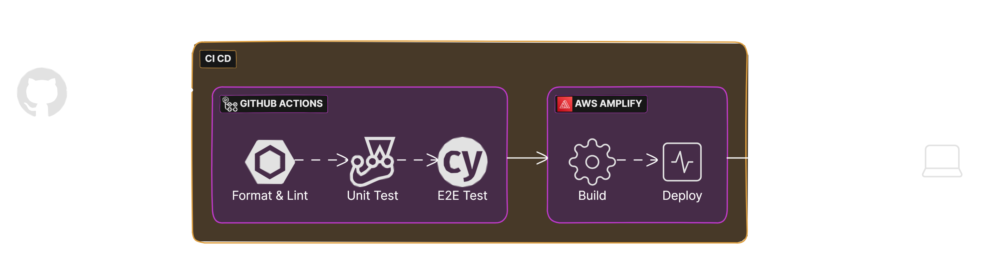

# CI/CD Documentation

This pipeline is set up to ensure our code is clean, reliable, and thoroughly tested before it hits the main branch. Here's how it flows:

CI/CD Flow Diagram

### Github Action Workflows

1. **[Large File Checks](../.github/workflows/checks.yml)**: We check for any oversized files. We don’t want anything over 5MB sneaking into the repository.

2. **[Code Quality Checks](../.github/workflows/checks.yml)**: Next, we run our code through ESLint and Prettier. This step makes sure everything is properly formatted and free of linting issues.

3. **[Unit Tests](../.github/workflows/tests.yaml)**: After that, Jest comes into play to run our unit tests. This checks if all the components and functions are behaving as they should be, catching any issues early on.

4. **[E2E Tests](../.github/workflows/tests.yaml)**: Finally, we dive into the E2E tests with Cypress. We run these tests in both Chrome and Firefox, making sure the app works as expected across different browsers. These tests also use MSW to mock APIs, ensuring our server-side rendering (SSR) flows are tested just right.

5. **Docker Integration**: We have integrated Docker into our CI/CD pipeline to ensure consistent environments across different stages of development and deployment. The Dockerfile is used to build a Docker image of the application, which is then used in various stages of the pipeline. This helps in maintaining consistency and simplifies the deployment process.

> Once the CI checks are cleared, our code automatically gets deployed using **_AWS Amplify_**.
