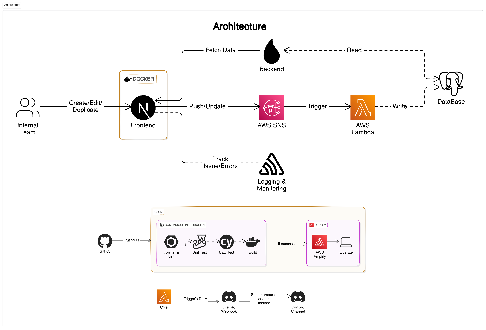
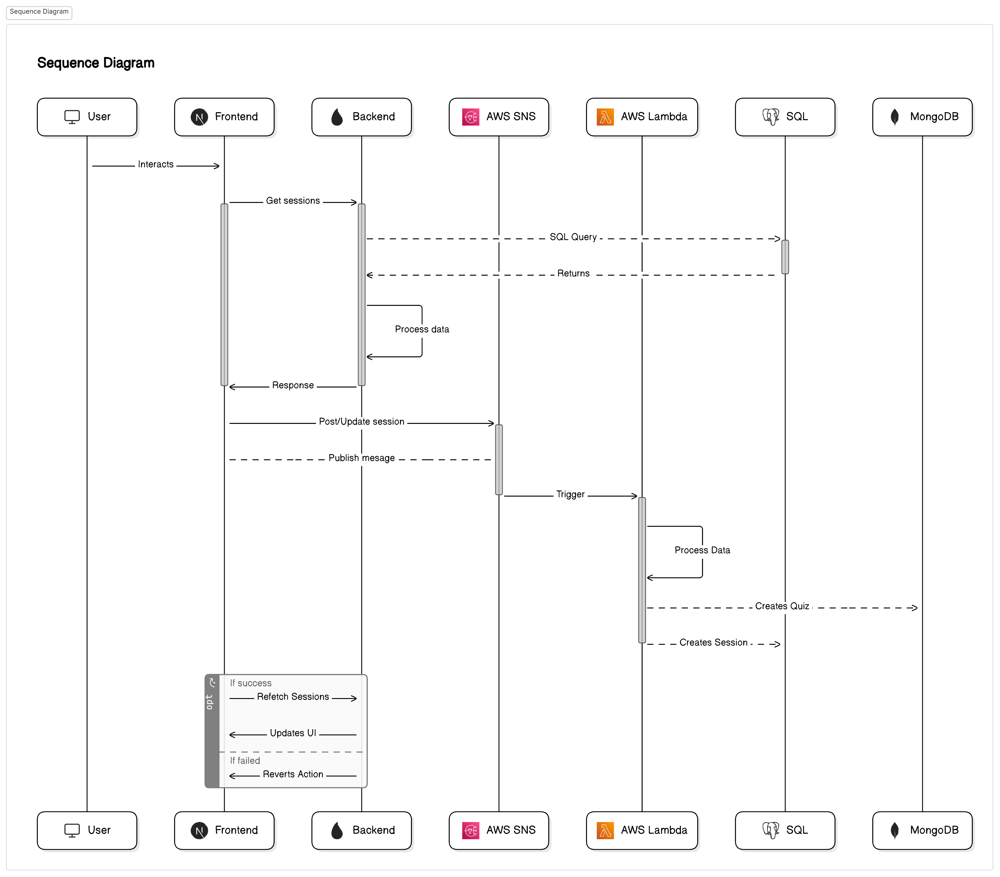

## Tech Stack

- [**Next.js**](https://nextjs.org/): A powerful React framework that delivers excellent performance, server-side rendering (good for SEO), and a structured approach to building web applications. Provides the foundation for the web app's structure and routing.
- [**TypeScript**](https://www.typescriptlang.org/): Adds static typing to JavaScript, improving code maintainability, reducing errors, and making the codebase more robust. Ensures clear type definitions and catches potential problems during development.
- [**React Hook Form**](https://react-hook-form.com/): Simplifies form creation, management, and validation within React applications, reducing boilerplate code and making form development more efficient.
- [**Tailwind CSS**](https://tailwindcss.com/): A utility-first CSS framework that provides granular control over styling. Enables rapid development and a consistent design system across your app.
- [**AWS SDK**](https://aws.amazon.com/developer/tools/): Provides tools to interact with AWS services like AWS Lambda and AWS SNS from within your application.

## Features

1. **Centralized Resource Management:** Organize and access quizzes, live classes, and other resources from one place.
2. **Session Management:** Create, update, delete, and duplicate sessions effortlessly.
3. **Serverless:** Integrate serverless lambda functions for scalability and dynamic backend logic.
4. **Server-Side Rendering (SSR):** Improve initial page load times and enhance search engine optimization (SEO).

## Page Routes

| Name                | Route format                             |
| ------------------- | ---------------------------------------- |
| Home (Pagenation)   | `/?pageNo={no}`                          |
| Session (Create)    | `/Session?type=create`                   |
| Session (Edit)      | `/Session?type=edit&sessionId={id}`      |
| Session (Duplicate) | `/Session?type=duplicate&sessionId={id}` |

## Diagrams

### Architecture

### Sequence Diagram

## Additional help

Various docs and repositories which are helpful for the project understanding

- [Backend](https://github.com/avantifellows/db-service)
- [Next.js Docs](https://nextjs.org/docs/)
- [Typescript Cheatsheets](https://www.typescriptlang.org/cheatsheets/)
- [AWS SNS Docs](https://docs.aws.amazon.com/sns/latest/dg/welcome.html)
- [React-Hook-Forms Docs](https://react-hook-form.com/get-started)
- [Pre-commit](https://pre-commit.com)
