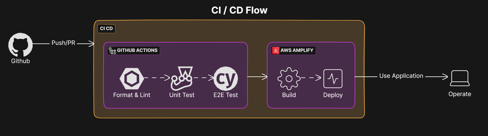

## Tech Stack

- [**Next.js**](https://nextjs.org/): A React framework that powers the structure and routing of the app. It offers features like server-side rendering, server-actions and gives a solid foundation for building scalable web applications.

- [**TypeScript**](https://www.typescriptlang.org/): This adds type safety to JavaScript, helping catch errors early and making the code easier to maintain. It ensures that the codebase is robust and reliable.

- [**React Hook Form**](https://react-hook-form.com/): A lightweight library that simplifies handling forms in React. It reduces the need for boilerplate code and makes form management and validation a breeze.

- [**Zod**](https://zod.dev/): A schema validation library that integrates well with TypeScript, ensuring that the data structures in your app are always correct and well-defined.

- [**Tailwind CSS**](https://tailwindcss.com/): A utility-first CSS framework that provides a lot of flexibility and control over styling. It speeds up development and helps maintain a consistent design across the app.

- [**ShadCN UI**](https://ui.shadcn.dev/): A collection of accessible components built with Tailwind CSS. It offers a great starting point for quickly building out user interfaces with consistent design.

- [**AWS SDK**](https://aws.amazon.com/developer/tools/): This toolkit allows the app to interact seamlessly with AWS services like Lambda and SNS, making it easier to build and scale cloud-based features.

- [**Cypress**](https://docs.cypress.io/): A powerful testing framework for writing end-to-end tests. It helps ensure that the app works as expected by simulating real user interactions.

- [**Jest**](https://jestjs.io/): A testing framework that makes it easy to write and run unit tests, helping catch bugs early in the development process.

- [**Prettier**](https://prettier.io/) & [**ESLint**](https://eslint.org/): Tools that automatically format and lint your code, keeping it clean, consistent, and error-free as you work.

## Features

1. **Create, Edit, and Duplicate Sessions**
   Easily manage sessions with options to create, edit, and duplicate.

2. **Presets for Ease**
   Simplifies form-filling with presets based on selected groups.

3. **Quiz & Live Table Management**
   Uses Tables with filtering, pagination, and expanded modals for more information.

4. **Real-Time Polling**
   Dynamically refreshes table data using polling for real-time updates.

5. **Server-Side Rendering with Server Actions**
   Delivers fast pages and handles form submissions with SSR and Server Actions in Next.js.

6. **End-to-End (E2E) Testing**
   Ensures application reliability and functionality through comprehensive Cypress E2E tests.

## Routes

| Name                  | Route format                                |
| --------------------- | ------------------------------------------- |
| Quiz Table            | `/?page={page-number}`                      |
| Live Table            | `/live?page={page-number}`                  |
| Session Dynamic Route | `/session/{action-type}?step={active-step}` |

- **_page-number_** - any integer number
- **_action-type_** - `create` | `edit` | `duplicate`
- **_active-step_** - `basic` | `platform` | `timeline`

## Diagrams

Architecture

Sequence Diagram

CI/CD Flow Diagram

## Additional Help

Various docs and repositories that are helpful for understanding the project:

- [Next.js Docs](https://nextjs.org/docs/)
- [Typescript Cheatsheets](https://www.typescriptlang.org/cheatsheets/)
- [React-Hook-Form Docs](https://react-hook-form.com/get-started/)
- [ShadCN UI Docs](https://ui.shadcn.dev/docs)
- [Tailwind CSS Docs](https://tailwindcss.com/docs)
- [Cypress Docs](https://docs.cypress.io/)
- [Zod Docs](https://zod.dev/)
- [Jest Docs](https://jestjs.io/docs/getting-started)
