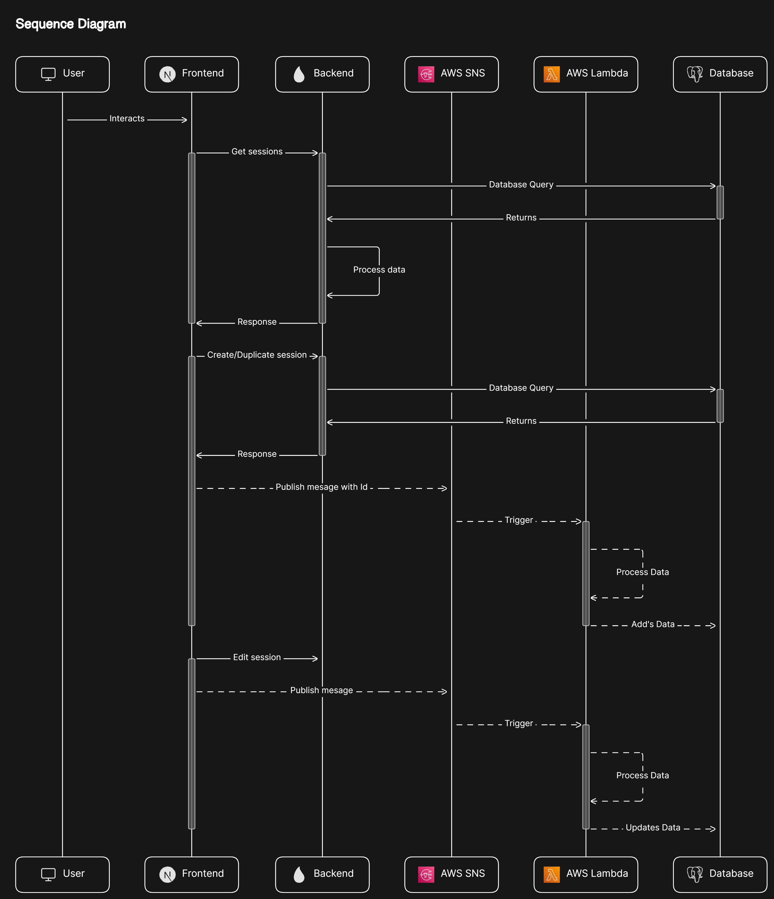

## Tech Stack

- [**Next.js**](https://nextjs.org/): A React framework that powers the structure and routing of the app. It offers features like server-side rendering, server-actions and gives a solid foundation for building scalable web applications.

- [**TypeScript**](https://www.typescriptlang.org/): This adds type safety to JavaScript, helping catch errors early and making the code easier to maintain. It ensures that the codebase is robust and reliable.

- [**React Hook Form**](https://react-hook-form.com/): A lightweight library that simplifies handling forms in React. It reduces the need for boilerplate code and makes form management and validation a breeze.

- [**Zod**](https://zod.dev/): A schema validation library that integrates well with TypeScript, ensuring that the data structures in your app are always correct and well-defined.

- [**Tailwind CSS**](https://tailwindcss.com/): A utility-first CSS framework that provides a lot of flexibility and control over styling. It speeds up development and helps maintain a consistent design across the app.

- [**ShadCN UI**](https://ui.shadcn.dev/): A collection of accessible components built with Tailwind CSS. It offers a great starting point for quickly building out user interfaces with consistent design.

- [**AWS SDK**](https://aws.amazon.com/developer/tools/): This toolkit allows the app to interact seamlessly with AWS services like Lambda and SNS, making it easier to build and scale cloud-based features.

- [**Cypress**](https://docs.cypress.io/): A powerful testing framework for writing end-to-end tests. It helps ensure that the app works as expected by simulating real user interactions.

- [**Jest**](https://jestjs.io/): A testing framework that makes it easy to write and run unit tests, helping catch bugs early in the development process.

- [**Prettier**](https://prettier.io/) & [**ESLint**](https://eslint.org/): Tools that automatically format and lint your code, keeping it clean, consistent, and error-free as you work.

## Features

1. **Create, Edit, and Duplicate Sessions:**
   Easily manage sessions with options to create, edit, and duplicate.

2. **Presets for Ease:**
   Simplifies form-filling with presets based on selected groups.

3. **Quiz & Live Table Management:**
   Uses Tables with filtering, pagination, and expanded modals for more information.

4. **Real-Time Polling:**
   Dynamically refreshes table data using polling for real-time updates.

5. **Server-Side Rendering with Server Actions:**
   Delivers fast pages and handles form submissions with SSR and Server Actions in Next.js.

6. **End-to-End (E2E) Testing:**
   Ensures application reliability and functionality through comprehensive Cypress E2E tests.

## Routes

| Name                  | Route format                                |
| --------------------- | ------------------------------------------- |
| Quiz Table            | `/?page={page-number}`                      |
| Live Table            | `/live?page={page-number}`                  |
| Session Dynamic Route | `/session/{action-type}?step={active-step}` |

- **_page-number_** - any integer number
- **_action-type_** - `create` | `edit` | `duplicate`
- **_active-step_** - `basic` | `platform` | `timeline`

## Sample Session

<details>
<summary>Sample Quiz Session</summary>

```json
{
  "auth_type": "ID",
  "created_by_id": null,
  "end_time": "2024-08-26T16:00:00Z",
  "id": 825,
  "id_generation": false,
  "inserted_at": "2024-08-19T11:54:57",
  "is_active": true,
  "meta_data": {
    "admin_testing_link": "https://staging-quiz.avantifellows.org/quiz/66c5fb6b23b8aa8bac7665d4?apiKey=6qOO8UdF1EGxLgzwIbQN&userId=test_admin",
    "batch_id": "HaryanaStudents_9_Foundation_24_001",
    "cms_test_id": "https://cms.peerlearning.com/chapter_tests/6556f6763562d97a6300aa35",
    "course": "Foundation",
    "date_created": "2024-08-19T17:24:57.292Z",
    "grade": 9,
    "group": "HaryanaStudents",
    "has_synced_to_bq": false,
    "infinite_session": false,
    "marking_scheme": "4,-1",
    "number_of_fields_in_popup_form": "",
    "optional_limits": "N/A",
    "parent_id": "HR-9-Foundation-24",
    "report_link": "https://lnk.avantifellows.org/8KdG",
    "shortened_link": "https://lnk.avantifellows.org/Jtcn",
    "show_answers": false,
    "show_scores": true,
    "status": "success",
    "stream": "pcmb",
    "test_format": "mock_test",
    "test_purpose": "one_time",
    "test_takers_count": 10,
    "test_type": "assessment"
  },
  "name": "Cypress Quiz Session",
  "owner_id": null,
  "platform": "quiz",
  "platform_id": "66c5fb6b23b8aa8bac7665d4",
  "platform_link": "66c5fb6b23b8aa8bac7665d4",
  "popup_form": false,
  "popup_form_id": null,
  "portal_link": "https://staging-auth.avantifellows.org?sessionId=HaryanaStudents_66c5fb6b23b8aa8bac7665d4",
  "purpose": {
    "params": "quiz",
    "type": "attendance"
  },
  "redirection": true,
  "repeat_schedule": {
    "params": [1, 2, 3, 4, 5],
    "type": "weekly"
  },
  "session_id": "HaryanaStudents_66c5fb6b23b8aa8bac7665d4",
  "signup_form": false,
  "signup_form_id": null,
  "start_time": "2024-08-19T10:00:00Z",
  "type": "sign-in",
  "updated_at": "2024-08-21T14:36:30"
}
```

</details>

<details>
<summary>Sample Live Session</summary>

```json
{
  "auth_type": "ID",
  "created_by_id": null,
  "end_time": "2024-08-23T20:00:00Z",
  "id": 826,
  "id_generation": false,
  "inserted_at": "2024-08-19T12:21:29",
  "is_active": true,
  "meta_data": {
    "batch_id": "HaryanaStudents_9_Foundation_24_001,HaryanaStudents_10_Foundation_24_001",
    "date_created": "2024-08-19T17:51:28.813Z",
    "grade": 9,
    "group": "HaryanaStudents",
    "number_of_fields_in_popup_form": "",
    "parent_id": "",
    "shortened_link": "https://lnk.avantifellows.org/L7gH",
    "status": "success",
    "subject": "Maths,Physics",
    "test_takers_count": 10
  },
  "name": "Cypress Live Session Edit",
  "owner_id": null,
  "platform": "youtube",
  "platform_id": "jfKfPfyJRdk",
  "platform_link": "https://www.youtube.com/live/jfKfPfyJRdk",
  "popup_form": false,
  "popup_form_id": null,
  "portal_link": "https://staging-auth.avantifellows.org?sessionId=HaryanaStudents_HaryanaStudents_9_Foundation_24_001,HaryanaStudents_10_Foundation_24_001_45523_jfKfPfyJRdk",
  "purpose": {
    "sub-type": "liveclass"
  },
  "redirection": true,
  "repeat_schedule": {
    "params": [1, 2, 3, 4, 5, 6, 7],
    "type": "weekly"
  },
  "session_id": "HaryanaStudents_HaryanaStudents_9_Foundation_24_001,HaryanaStudents_10_Foundation_24_001_45523_jfKfPfyJRdk",
  "signup_form": false,
  "signup_form_id": null,
  "start_time": "2024-08-19T08:00:00Z",
  "type": "sign-in",
  "updated_at": "2024-08-19T12:28:26"
}
```

</details>

## Diagrams

<details>
<summary>Architecture</summary>


</details>

<details>

<summary>Sequence Diagram</summary>



</details>

## Additional Help

Various docs and repositories that are helpful for understanding the project:

- [Next.js Docs](https://nextjs.org/docs/)
- [Typescript Cheatsheets](https://www.typescriptlang.org/cheatsheets/)
- [React-Hook-Form Docs](https://react-hook-form.com/get-started/)
- [ShadCN UI Docs](https://ui.shadcn.dev/docs)
- [Tailwind CSS Docs](https://tailwindcss.com/docs)
- [Cypress Docs](https://docs.cypress.io/)
- [Zod Docs](https://zod.dev/)
- [Jest Docs](https://jestjs.io/docs/getting-started)
